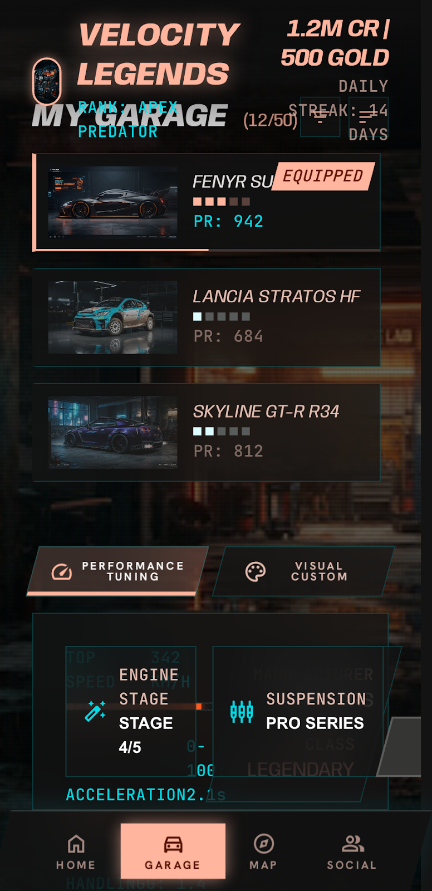
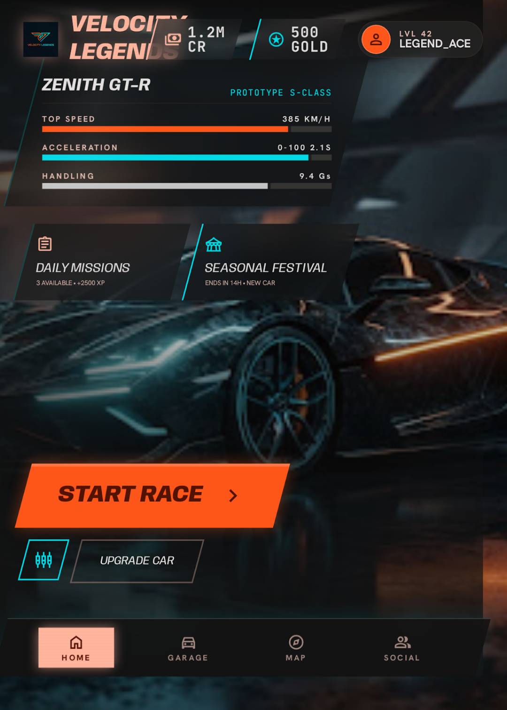
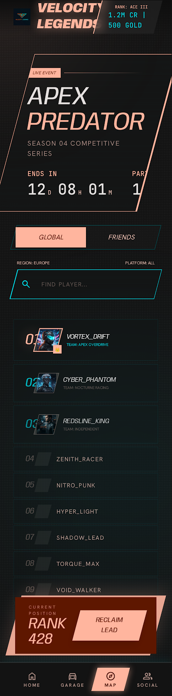
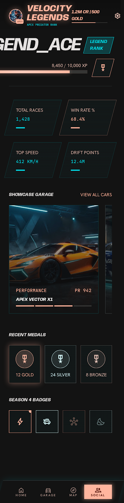
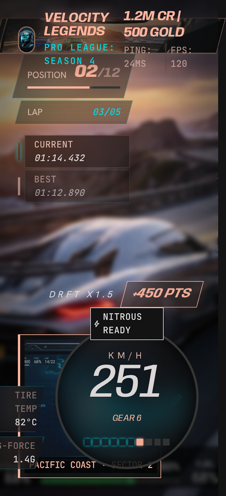
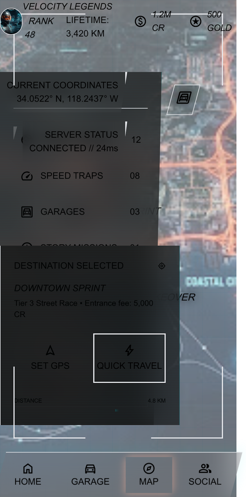

# 🏎️ Velocity Legends

A high-octane racing game UI built with HTML, Tailwind CSS, and vanilla JavaScript. Features a futuristic "Future-Sport" design system with glassmorphism HUD elements, scanline effects, and aggressive typography.


## 📸 Screenshots

| Screen | Preview |
|--------|---------|
| **Home** |  |
| **Garage** |  |
| **Leaderboard** |  |
| **Profile** |  |
| **Race HUD** |  |
| **Map** |  |

## ✨ Features

- 🎮 **5 Interactive Screens**: Home, Garage, Leaderboard, Profile, Race HUD
- 🎨 **Glassmorphism HUD Design** with scanline overlays and digital effects
- 📱 **Responsive Layout** with mobile-safe zones (32px margins)
- ⚡ **Real-time Telemetry Simulation** (speedometer, lap times, drift points)
- 🏁 **Aggressive Typography** using Anybody (headlines), Hanken Grotesk (body), JetBrains Mono (data)
- 🌐 **Shared Bottom Navigation** across all menu screens

## 🛠️ Tech Stack

| Technology | Purpose |
|------------|---------|
| HTML5 | Structure |
| Tailwind CSS (CDN) | Styling & Layout |
| Google Fonts | Typography (Anybody, Hanken Grotesk, JetBrains Mono) |
| Material Symbols | Icons |
| Vanilla JavaScript | Interactivity |

## 🚀 Quick Start

1. Clone the repository:
   ```bash
   git clone https://github.com/YOUR_USERNAME/velocity-legends.git
   cd velocity-legends
   ```

2. Open any HTML file in your browser:
   ```bash
   open index.html        # Home screen
   open garage.html       # Car garage
   open leaderboard.html  # Global rankings
   open profile.html      # Player profile
   open race.html         # In-race HUD
   ```

> **Note**: The game uses CDN links for Tailwind CSS and Google Fonts, so an internet connection is required for full styling.

## 📁 Project Structure

```
velocity-legends/
├── index.html              # Home / Main screen
├── garage.html             # Car selection & tuning
├── leaderboard.html        # Global leaderboards
├── profile.html            # Player profile & stats
├── race.html               # In-race HUD overlay
├── DESIGN.md               # Full design system spec
├── README.md               # This file
└── assets/
    ├── images/
    │   ├── logo.png              # Game logo
    │   ├── screen-home.png       # Screenshot: Home
    │   ├── screen-garage.png     # Screenshot: Garage
    │   ├── screen-leaderboard.png # Screenshot: Leaderboard
    │   ├── screen-profile.png    # Screenshot: Profile
    │   ├── screen-race-hud.png   # Screenshot: Race HUD
    │   └── screen-map.png        # Screenshot: Map
    ├── css/                    # (For future extracted styles)
    └── js/                     # (For future extracted scripts)
```

## 🎨 Design System

See [DESIGN.md](DESIGN.md) for the complete design specification including:
- Color palette (Velocity Orange, Electric Cyan, Carbon Black)
- Typography scale (Display Hero, Headline, Body, Data, Label Caps)
- Spacing system (4px baseline grid)
- Component guidelines (Buttons, HUD Glass, Telemetry Chips, Progress Bars)
- Elevation & depth rules

## 🖼️ Image Assets Note

The HTML files currently reference Google-hosted images (AI-generated car renders, avatars, backgrounds). These cannot be downloaded directly. To make the project fully self-contained:

1. Replace Google image URLs with your own assets
2. Or use placeholder services like [Placeholder.com](https://placeholder.com) or [Unsplash](https://unsplash.com)
3. See `IMAGE_MAPPING.md` for a full list of images used in each screen

## 📝 License

MIT License - feel free to use this for personal or commercial projects.

---

*Built with speed. Designed for legends.* 🏁
